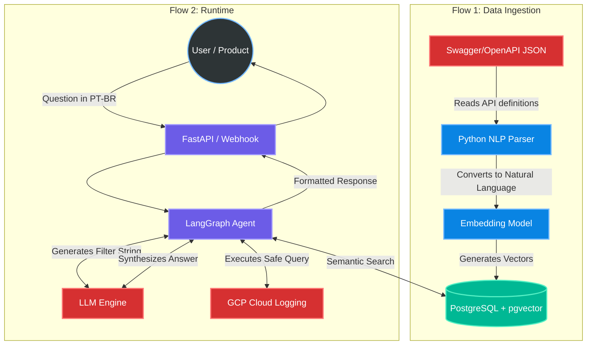
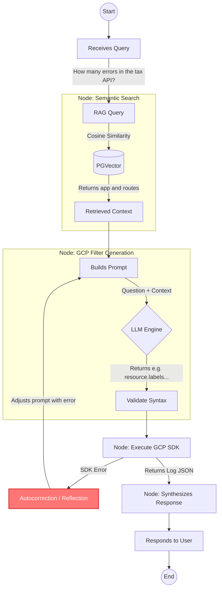

# NL2Query: RAG + GCP Observability POC 🚀

## 🎯 Goal
Proof of Concept (POC) to validate building a natural language interface (Text-to-Query) capable of querying logs and metrics in GCP Cloud Logging. The solution uses RAG (Retrieval-Augmented Generation) to correlate the user's business intent with the technical infrastructure (routes, microservices, and labels) without requiring static dictionaries.

## 🏗️ System Architecture

The system is divided into two independent major flows: the **Data Ingestion Pipeline (Data Prep)** and the **Execution Engine (Runtime/LangGraph)**.

### 1. Architecture Overview

### 2. LangGraph Execution Flow (Harness)
Below is the decision graph detail that the agent executes for each new request.

## 🛠️ Technology Stack (POC)

### Ingestion Flow (Data Pipeline)
* **Language**: Python 3.11+
* **Processing**: LangChain / LlamaIndex (for chunking and NLP parsing)
* **Database**: PostgreSQL (via Docker) with the pgvector extension
* **Embeddings**: Google Gemini embedding models (or OpenAI/Local text-embedding-3)

### Runtime Flow (Agent)
* **Web Framework**: FastAPI
* **AI Orchestration**: LangGraph (state, node, and routing cycle management)
* **LLM Core**: Gemini 1.5 Pro / GPT-4o (filter code generation and synthesis)
* **Cloud Integration**: google-cloud-logging SDK